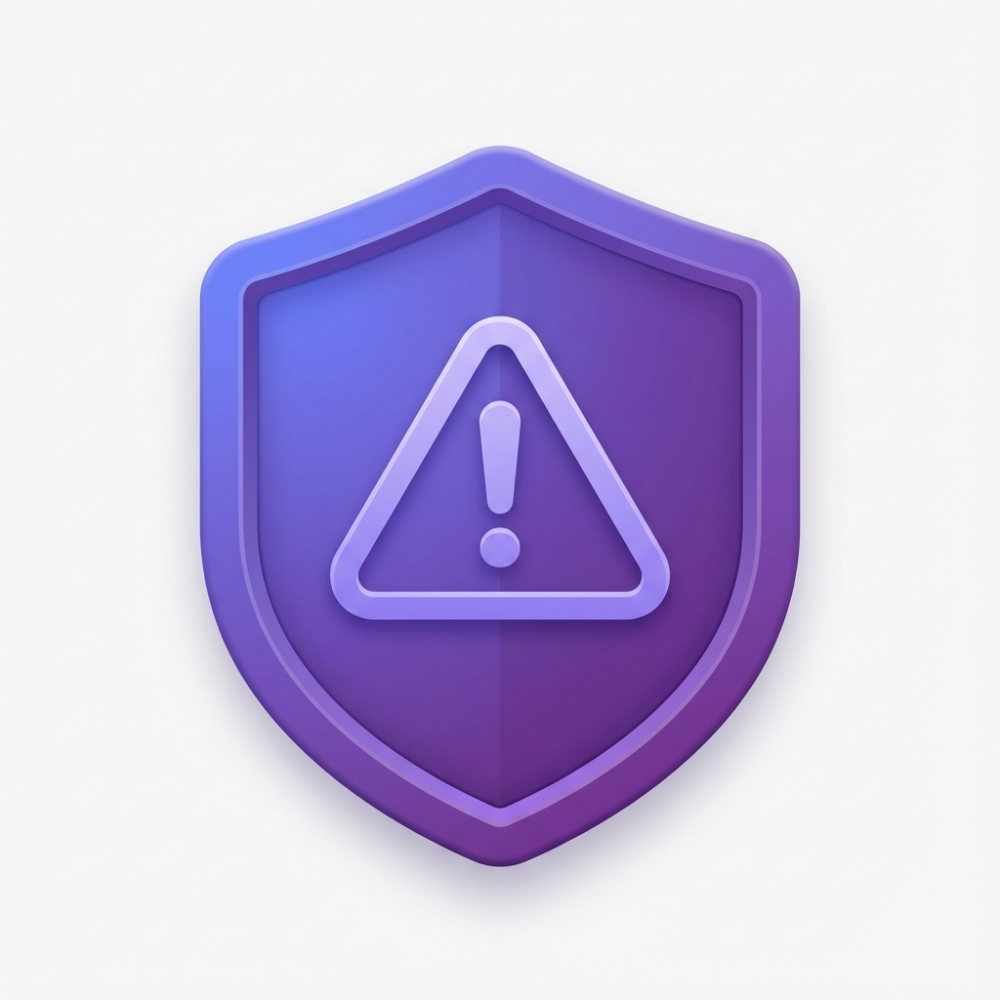
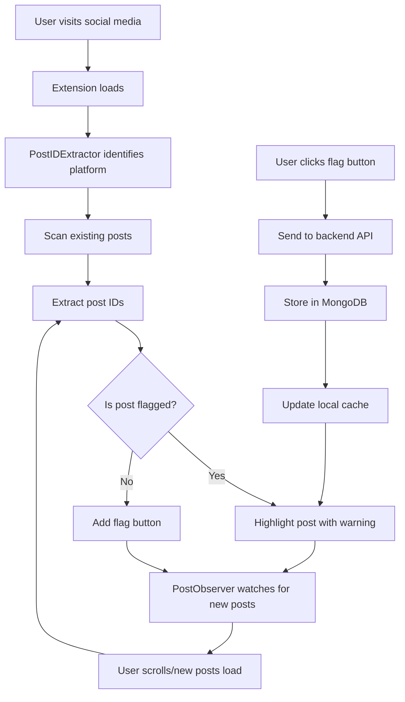

# Post Detector - Social Media Impersonation Detection Extension

A Chrome extension that detects and highlights impersonated posts on social media platforms (Facebook, Instagram, Twitter/X, LinkedIn) with community-driven flagging powered by MongoDB.



## 🚀 Features

- **Automatic Detection**: Extracts unique post IDs from social media platforms
- **Visual Highlighting**: Flagged posts are highlighted with warning banners
- **Community Flagging**: Users can flag suspicious posts with one click
- **Multi-Platform Support**: Works on Facebook, Instagram, Twitter/X, and LinkedIn
- **Real-Time Updates**: New posts are automatically scanned as you scroll
- **Privacy-First**: IP addresses are hashed, no personal data stored
- **Offline Support**: Cached flagged posts work even when backend is offline

## 📁 Project Structure

```
PostDetector/
├── extension/                   # Chrome Extension
│   ├── background/
│   │   └── service-worker.js   # Background tasks, badge updates
│   ├── content/
│   │   ├── content.js          # Main orchestrator
│   │   ├── highlighter.js      # Visual highlighting logic
│   │   └── observer.js         # DOM mutation observer
│   ├── icons/
│   │   ├── icon16.png
│   │   ├── icon48.png
│   │   └── icon128.png
│   ├── popup/
│   │   ├── popup.html          # Extension popup UI
│   │   ├── popup.css
│   │   └── popup.js
│   ├── styles/
│   │   └── highlight.css       # Post highlight styles
│   ├── utils/
│   │   └── id-extractor.js     # Post ID extraction
│   └── manifest.json           # Extension manifest
├── backend/
│   ├── backend_server.js       # Express API server
│   ├── package.json
│   └── .env.example            # Environment config template
└── README.md
```

## 🛠️ Installation & Setup

### Prerequisites

- **Node.js** v16 or higher
- **MongoDB** (local installation or MongoDB Atlas account)
- **Google Chrome** browser

### Backend Setup

1. **Navigate to backend directory**:
   ```bash
   cd backend
   ```

2. **Install dependencies**:
   ```bash
   npm install
   ```

3. **Configure environment**:
   ```bash
   # Copy environment template
   copy .env.example .env
   
   # Edit .env and configure:
   # - PORT=3000
   # - MONGODB_URI=mongodb://localhost:27017/impersonation-detector
   ```

4. **Start MongoDB**:
   - **Local MongoDB**: Start the MongoDB service or run `mongod.exe`
   - **MongoDB Atlas**: Use the connection string from your Atlas cluster

5. **Start the server**:
   ```bash
   npm start
   ```
   
   The server will start on `http://localhost:3000`

### Extension Setup

1. **Open Chrome Extensions page**:
   - Navigate to `chrome://extensions/`
   - Enable **Developer mode** (toggle in top right)

2. **Load the extension**:
   - Click **"Load unpacked"**
   - Select the `d:\PostDetector\extension` directory
   - The extension icon should appear in your toolbar

3. **Verify installation**:
   - Click the extension icon to open the popup
   - You should see the dashboard interface

## 📖 How to Use

### For Regular Users

1. **Browse Social Media**: Navigate to Facebook, Instagram, Twitter, or LinkedIn

2. **Automatic Detection**: The extension automatically scans posts and highlights flagged ones with a red border and warning banner

3. **Flag a Post**: Click the **"⚠️ Flag as Impersonation"** button on any post to report it

4. **View Statistics**: Click the extension icon to see:
   - Number of posts scanned on current page
   - Number of flagged posts
   - Global statistics across all platforms

5. **Manage Settings**: Toggle highlighting and notifications in the popup

### For Developers

**API Endpoints**:

- `GET /api/health` - Health check
- `GET /api/posts/flagged?platform=facebook` - Get flagged posts for a platform
- `POST /api/posts/flag` - Flag a post
- `GET /api/posts/:platform/:postId` - Get details of specific post
- `GET /api/stats` - Get global statistics

**Example: Flag a Post**
```javascript
fetch('http://localhost:3000/api/posts/flag', {
  method: 'POST',
  headers: { 'Content-Type': 'application/json' },
  body: JSON.stringify({
    postId: '1930361267548490',
    platform: 'facebook',
    url: 'https://www.facebook.com/groups/123/posts/1930361267548490/'
  })
})
```

## 🔧 How It Works

### Post ID Extraction

Each platform has unique post identifiers:

| Platform | Example URL | Post ID |
|----------|------------|---------|
| Facebook | `/posts/1930361267548490/` | `1930361267548490` |
| Instagram | `/p/ABC123xyz_/` | `ABC123xyz_` |
| Twitter | `/status/1234567890123456789` | `1234567890123456789` |
| LinkedIn | `/activity-1234567890123456789` | `1234567890123456789` |

The `id-extractor.js` uses DOM selectors and regex patterns to extract these IDs.

### Detection Flow



### Database Schema

**Posts Collection**:
```javascript
{
  postId: String,           // Unique post ID
  platform: String,         // facebook, instagram, twitter, linkedin
  url: String,              // Original post URL
  flagCount: Number,        // Number of community reports
  status: String,           // pending, confirmed, dismissed
  firstReported: Date,
  lastReported: Date,
  reporters: [{             // Hashed IPs for privacy
    ipHash: String,
    timestamp: Date
  }]
}
```

## 🎨 Visual Highlighting

Flagged posts are styled with:
- **Red border** with subtle glow effect
- **Warning banner** at top of post
- **Pulse animation** when newly flagged
- **Dismissible** warning (click × to hide)

## 🔒 Privacy & Security

- **IP Hashing**: User IPs are SHA-256 hashed before storage
- **Rate Limiting**: API requests limited to prevent abuse
- **CORS Protection**: Backend restricts cross-origin requests
- **No Authentication Required**: Extension reads public posts only
- **Local Caching**: Flagged posts cached locally for offline use

## ⚙️ Configuration

### Extension Settings (via popup)

- **Enable Highlighting**: Toggle post highlighting on/off
- **Show Notifications**: Toggle success/error notifications
- **Confidence Threshold**: Automatic highlighting threshold (1+ flags)

### Backend Configuration (.env)

```env
PORT=3000
MONGODB_URI=mongodb://localhost:27017/impersonation-detector
NODE_ENV=development
```

## 🧪 Testing

### Manual Testing Checklist

- [ ] Extension loads without errors in `chrome://extensions/`
- [ ] Backend server starts and `/api/health` returns OK
- [ ] Facebook post detection works
- [ ] Instagram post detection works
- [ ] Twitter/X post detection works
- [ ] Flag button appears on posts
- [ ] Flagging workflow completes successfully
- [ ] Post remains highlighted after page refresh
- [ ] Popup displays correct statistics
- [ ] Settings persist after closing popup

### API Testing

Test the health endpoint:
```bash
curl http://localhost:3000/api/health
```

Test getting flagged posts:
```bash
curl http://localhost:3000/api/posts/flagged?platform=facebook
```

## 🐛 Troubleshooting

### Extension Not Loading
- Ensure all files are in the correct directory structure
- Check Chrome DevTools console for errors
- Verify `manifest.json` is valid JSON

### Backend Connection Failed
- Confirm MongoDB is running
- Check `MONGODB_URI` in `.env`
- Verify backend server is running on correct port
- Check browser console for CORS errors

### Posts Not Being Detected
- Open DevTools console and look for `[Post Detector]` logs
- Verify you're on a supported platform
- Try refreshing the page
- Check that platform selectors haven't changed (social media sites update frequently)

### Flagging Not Working
- Ensure backend server is accessible
- Check Network tab in DevTools for failed requests
- Verify MongoDB is accepting connections
- Check for rate limiting (100 requests per 15 minutes)

## 🚧 Known Limitations

- **Platform Changes**: Social media sites frequently change their DOM structure, requiring selector updates
- **Dynamic Content**: Some platforms use heavy client-side rendering which may delay detection
- **Rate Limits**: Backend implements rate limiting to prevent abuse
- **Local Backend**: Currently requires local server; production deployment needed for wider use

## 🔮 Future Enhancements

- **Browser Sync**: Sync flagged posts across devices
- **ML Detection**: Automatic impersonation detection using machine learning
- **Admin Dashboard**: Web interface for managing flagged posts
- **Multi-Browser Support**: Firefox and Edge versions
- **Reputation System**: User reputation scores for trusted reporters
- **Categories**: Different flag types (spam, scam, misinformation)

## 📄 License

ISC License

## 🤝 Contributing

Contributions welcome! Please ensure:
1. Code follows existing style
2. All functions are documented
3. Tests pass before submitting

## 📞 Support

For issues or questions:
1. Check the troubleshooting section
2. Review browser console logs
3. Check backend server logs
4. Open an issue with detailed information

---

**Built with ❤️ for safer social media browsing**
